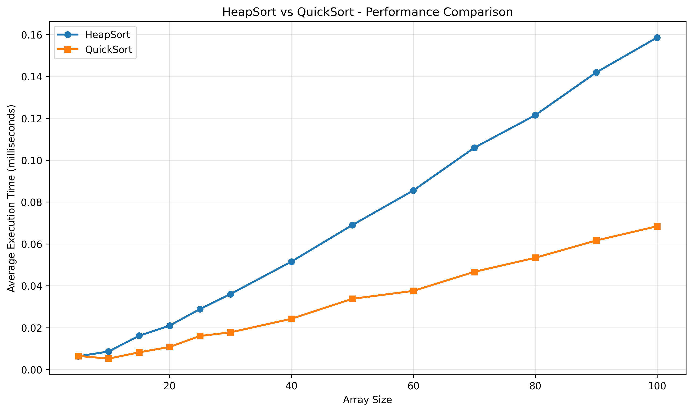
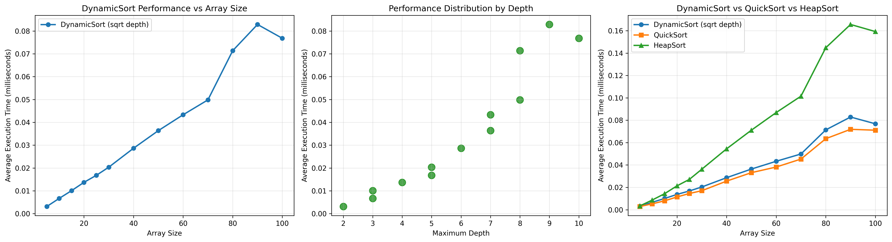
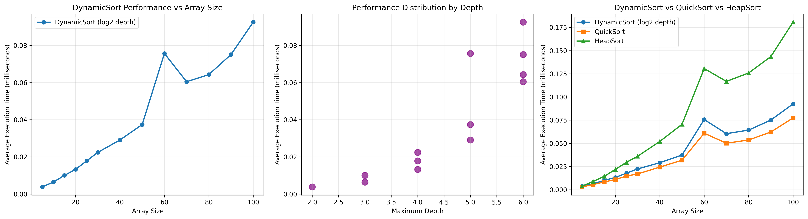
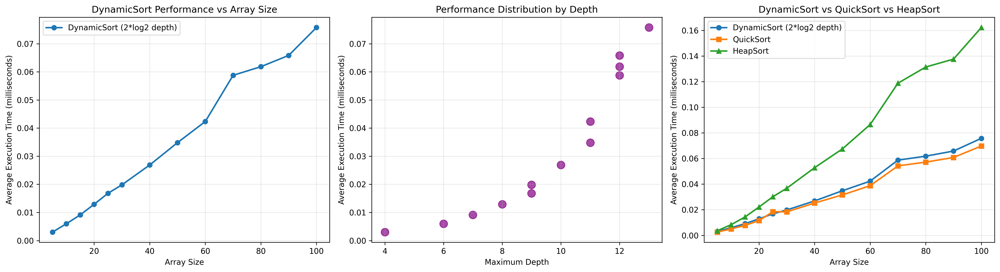
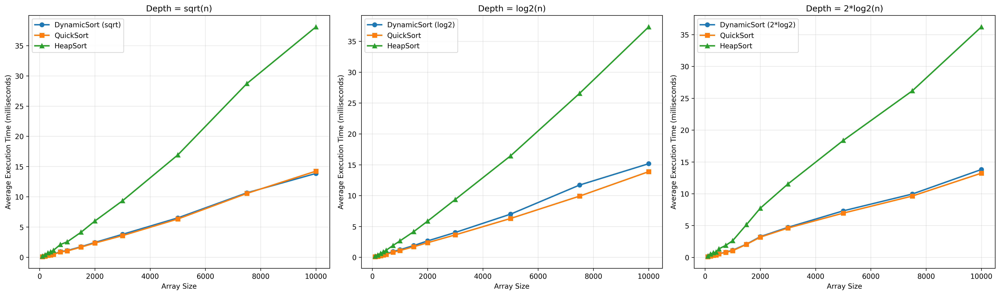
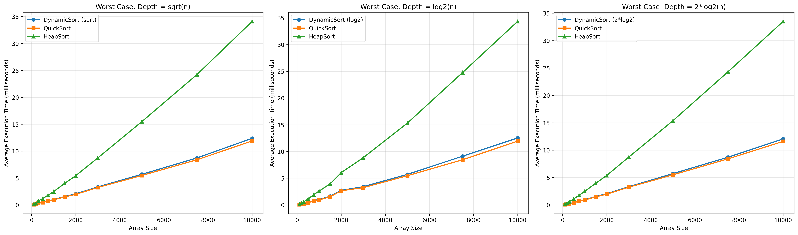

# 1dv018 - Assignment 3

We are tasked with implementing different tasks. This is the third assignment for the course 1DV018 at Linnaeus University.

## Requirements

- Python 3.8 or higher
- Matplotlib

## How to run

1. Start by downloading all the requirements:

```bash
pip install -r requirements.txt
```

2. Run the project:

```bash
python main.py
```

3. To generate the graphs for task 5, run: ***(Optional)***

```bash
python MatPlot.py
```

## Analysis and Conclusions in Swedish

## Task 1 - Analysis

### Heapsort vs Quicksort

Min första tanke var att jämföra Heapsort och Quicksort. Min hypotes var att Heapsort skulle vara snabbare på små arrayer, medan Quicksort skulle vara snabbare på stora arrayer. Jag förväntade mig därför att hitta en brytpunkt där Heapsort skulle korsa Quicksort i prestanda.

Resultaten visade dock att hypotesen inte stämde. Som vi kan se i graferna nedan är Quicksort konsekvent snabbare än Heapsort, även för små arrayer. Dessutom ökar skillnaden mellan algoritmerna ju större listorna blir.

Eftersom denna hypotes inte stämde behövde jag hitta ett annat sätt att bestämma det maximala djupet där Quicksort bör övergå till Heapsort.



I nästa expriment tänker jag att vi använder listans längd för att hitta ett nyckeltal för det maximala djupet för quicksort. Vi kan testa att använda roten ut listans längd och sedan köra floor på den.

---

### DynamicSort vs Quicksort vs Heapsort (√N-djup)

I detta experiment testade vi att dynamiskt beräkna max_depth som roten ur listans längd (√N).

Den första grafen visar hur algoritmens exekveringstid växer med arraystorleken, och den andra visar den genomsnittliga prestandan för varje maximalt djup som uppstod under körningarna.

I den högra grafen jämförs resultatet mot ren Quicksort och Heapsort. Vi ser att alla tre algoritmer presterar ungefär lika bra för små listor, men att Heapsort snabbt blir långsammare när listorna växer. DynamicSort (med √N-djup) följer Quicksort ganska nära, men är något långsammare vid större listor.

Den troliga förklaringen är att √N ger ett för stort maxdjup, vilket gör att Heapsort nästan aldrig används. DynamicSort beter sig därför nästan som en vanlig Quicksort – men med lite extra overhead. Slutsatsen är alltså att √N inte är en optimal gräns för att byta till Heapsort; gränsen bör vara betydligt mindre.



---

### DynamicSort vs Quicksort vs Heapsort (log2(N)-djup)

Eftersom roten ur N inte visade sig vara en optimal gräns för att byta till Heapsort testade jag istället att använda log₂(N) som maxdjup. Detta ger ett betydligt mindre värde än roten ur N. Exempelvis är √100 = 10, medan log₂(100) ≈ 6,64. Frågan var om detta kunde skapa en bättre och mer balanserad gräns för när algoritmen bör växla till Heapsort.

När vi tittar på grafen ser vi att DynamicSort fortfarande är något långsammare än Quicksort. Skillnaden mellan de två algoritmerna har dock ökat jämfört med experimentet där maxdjupet beräknades med √N.

Detta väcker frågan om de testade arrayerna kanske är för små för att ge en rättvis jämförelse. Ett naturligt nästa steg blir därför att undersöka om en multipel av log₂(N), till exempel 2·log₂(N), kan ge en bättre balanspunkt för att byta till Heapsort.



---

### DynamicSort vs Quicksort vs Heapsort (2*log2(N)-djup)

Här kan vi se att resultatet ger en tydligare jämförelse mellan DynamicSort och Quicksort. DynamicSort ligger fortfarande något efter i prestanda, men skillnaden är liten. Jag anser att det är ungefär här som gränsen för att byta till Heapsort blir optimal, eftersom de båda algoritmernas kurvor följer varandra mycket nära samtidigt som Heapsort fortfarande används vid behov.

När vi använder 2·log₂(N) hamnar värdet ungefär mitt emellan log₂(N) och √N. Det verkar ge en bra balans mellan att inte byta för tidigt (vilket gör algoritmen långsammare) och att inte vänta för länge (vilket riskerar att Quicksort går för djupt). Därför bedömer jag att 2·log₂(N) är en mer lämplig gräns för att byta till Heapsort.

<!-- > Formel: max_depth = 2 * log2(N) -->



### Slutsats

Vi har nu testat flera olika formler för när DynamicSort ska byta från Quicksort till Heapsort. Den första idén var att använda roten ur listans längd som gräns för maxdjup, vilket visade sig fungera ganska bra för de liststorlekar vi testade.

Om vi till exempel har en lista med 100 element får vi ett maxdjup på 10 med roten ur, medan log₂(100) är 6,64. Tittar vi på tiden så ser vi en tydlig skillnad: med roten ur tar det strax över 0,075 ms, medan log₂(n) tar ungefär 0,100 ms. Det tyder på att algoritmen sällan når maxdjupet och därför nästan aldrig hinner byta till Heapsort när vi använder roten ur.

När vi testar med 2 × log₂(n) (vilket för 100 element ger ett maxdjup på cirka 20) märker vi att maxdjupet i praktiken aldrig uppnås. Det väcker frågan om vi kanske testar på för små listor för att verkligen se skillnaderna.



Vid tester på större listor ser vi att Heapsort är betydligt långsammare än både Quicksort och DynamicSort. Quicksort och DynamicSort ligger nästan exakt lika när roten ur används som formel, vilket antyder att maxdjupet sällan nås i detta fall. För log₂(n) ser vi däremot att prestandan är sämre, vilket tyder på att algoritmen faktiskt byter till Heapsort några gånger – och eftersom Heapsort är långsammare påverkar det total tiden negativt.
Formeln 2 × log₂(n) hamnar, som väntat, mitt emellan dessa två fall – maxdjupet nås ibland, men inte lika ofta som vid log₂(n).

√10 000 = 100
log₂(10 000) = 13,28
2 × log₂(10 000) = 26,57



När vi tittar på Quicksorts worst case är den fortfarande snabbare än DynamicSort, vilket gör det svårt att dra några entydiga slutsatser. Men utifrån resultaten verkar det ändå rimligt att anta att ett maxdjup någonstans mellan roten ur och log₂(n) ger en bra balans.

För en lista med 10 000 element skulle därför 2 × log₂(n) vara en rimlig kompromiss – mindre än roten ur, men mer än log₂(n).
