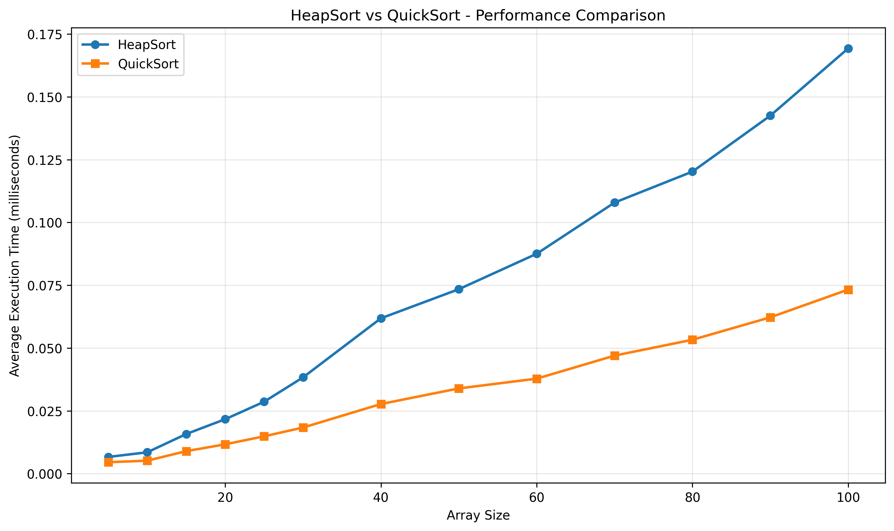

# 1dv018 - Assignment 3

INTRO

## Task 1 - Analysis

### Heapsort vs Quicksort

Min första tanke var att jämföra Heapsort och Quicksort. Min hypotes var att Heapsort skulle vara snabbare på små arrayer, medan Quicksort skulle vara snabbare på stora arrayer. Jag förväntade mig därför att hitta en brytpunkt där Heapsort skulle korsa Quicksort i prestanda.

Resultaten visade dock att hypotesen inte stämde. Som vi kan se i graferna nedan är Quicksort konsekvent snabbare än Heapsort, även för små arrayer. Dessutom ökar skillnaden mellan algoritmerna ju större listorna blir.

Eftersom denna hypotes inte stämde behövde jag hitta ett annat sätt att bestämma det maximala djupet där Quicksort bör övergå till Heapsort.

I nästa expriment tänker jag att vi använder listans längd för att hitta ett nyckeltal för det maximala djupet för quicksort. Vi kan testa att använda roten ut listans längd och sedan köra floor på den.

---

### DynamicSort vs Quicksort vs Heapsort (√N-djup)

I detta experiment testade vi att dynamiskt beräkna max_depth som roten ur listans längd (√N).

Den första grafen visar hur algoritmens exekveringstid växer med arraystorleken, och den andra visar den genomsnittliga prestandan för varje maximalt djup som uppstod under körningarna.

I den högra grafen jämförs resultatet mot ren Quicksort och Heapsort. Vi ser att alla tre algoritmer presterar ungefär lika bra för små listor, men att Heapsort snabbt blir långsammare när listorna växer. DynamicSort (med √N-djup) följer Quicksort ganska nära, men är något långsammare vid större listor.

Den troliga förklaringen är att √N ger ett för stort maxdjup, vilket gör att Heapsort nästan aldrig används. DynamicSort beter sig därför nästan som en vanlig Quicksort – men med lite extra overhead. Slutsatsen är alltså att √N inte är en optimal gräns för att byta till Heapsort; gränsen bör vara betydligt mindre.

---

### DynamicSort vs Quicksort vs Heapsort (log2(N)-djup)

Eftersom roten ur N inte visade sig vara en optimal gräns för att byta till Heapsort testade jag istället att använda log₂(N) som maxdjup. Detta ger ett betydligt mindre värde än roten ur N. Exempelvis är √100 = 10, medan log₂(100) ≈ 6,64. Frågan var om detta kunde skapa en bättre och mer balanserad gräns för när algoritmen bör växla till Heapsort.

När vi tittar på grafen ser vi att DynamicSort fortfarande är något långsammare än Quicksort. Skillnaden mellan de två algoritmerna har dock ökat jämfört med experimentet där maxdjupet beräknades med √N.

Detta väcker frågan om de testade arrayerna kanske är för små för att ge en rättvis jämförelse. Ett naturligt nästa steg blir därför att undersöka om en multipel av log₂(N), till exempel 2·log₂(N), kan ge en bättre balanspunkt för att byta till Heapsort.

---

### DynamicSort vs Quicksort vs Heapsort (2*log2(N)-djup)

Här kan vi se att resultatet ger en tydligare jämförelse mellan DynamicSort och Quicksort. DynamicSort ligger fortfarande något efter i prestanda, men skillnaden är liten. Jag anser att det är ungefär här som gränsen för att byta till Heapsort blir optimal, eftersom de båda algoritmernas kurvor följer varandra mycket nära samtidigt som Heapsort fortfarande används vid behov.

När vi använder 2·log₂(N) hamnar värdet ungefär mitt emellan log₂(N) och √N. Det verkar ge en bra balans mellan att inte byta för tidigt (vilket gör algoritmen långsammare) och att inte vänta för länge (vilket riskerar att Quicksort går för djupt). Därför bedömer jag att 2·log₂(N) är en mer lämplig gräns för att byta till Heapsort.

> Formel: max_depth = 2 * log2(N)

LÄGG TILL NÅGOT OM WORST CASE
